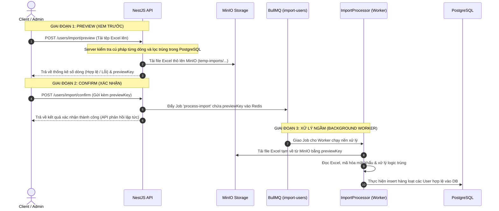
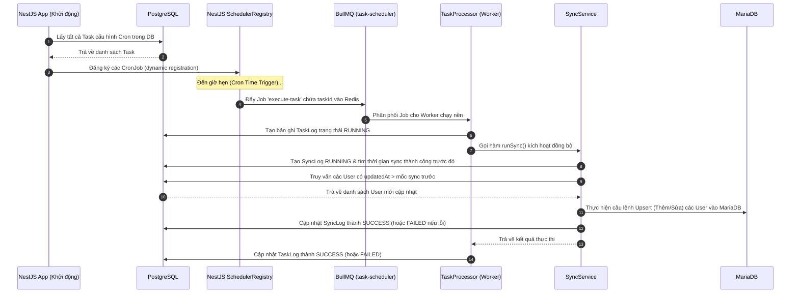
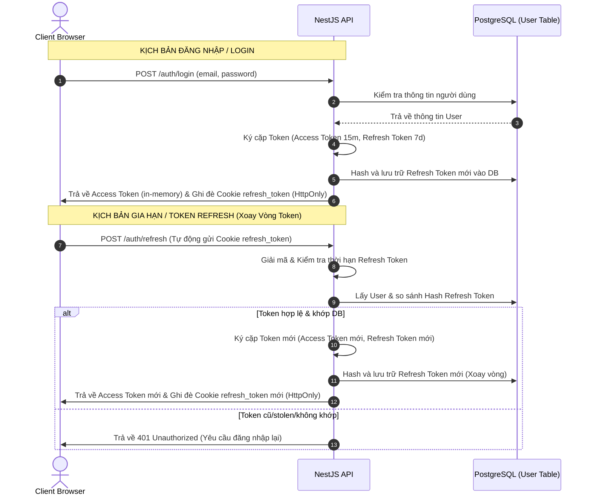
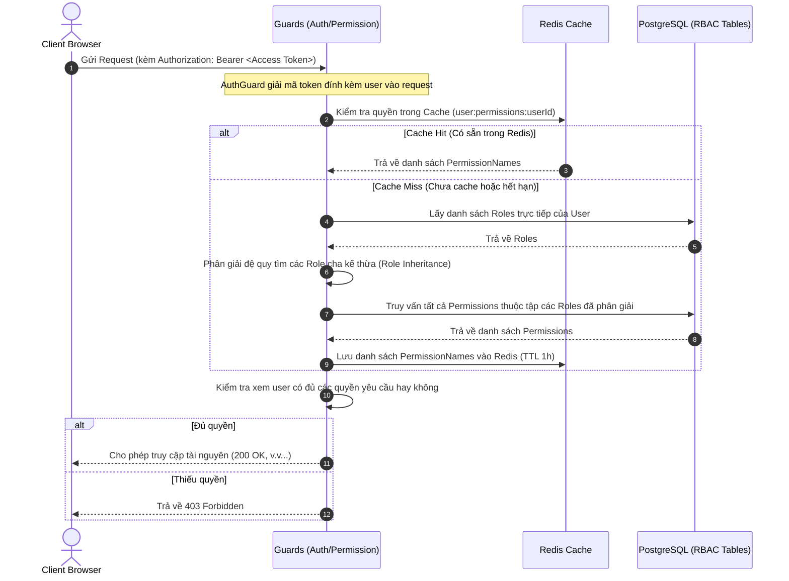

# NestJS Task Scheduler & User Management Sync Panel

Hệ thống quản trị và đồng bộ dữ liệu nâng cao sử dụng **NestJS** kết hợp **Redis (BullMQ)**, lưu trữ đám mây **MinIO**, và kiến trúc đa cơ sở dữ liệu **PostgreSQL** (Primary DB) & **MariaDB** (Secondary DB).

## 🚀 Tính Năng Cốt Lõi (Core Features)

1.  **Quản lý & Lập lịch Cron Job Động**:
    *   Thêm, sửa, xóa các tác vụ Cron trong runtime mà không cần khởi động lại ứng dụng NestJS (sử dụng `@nestjs/schedule` và Scheduler Registry).
    *   Bộ kiểm tra biểu thức Cron (Cron Expression Builder) 6 trường kết hợp dự báo thời gian chạy tiếp theo chính xác.
2.  **Hàng đợi & Worker Xử lý Ngầm (Redis & BullMQ)**:
    *   Tách biệt vai trò: Producer đẩy job lên Redis Queue, Consumer (TaskProcessor Worker) nhận và xử lý ngầm bất đồng bộ ở background.
    *   **Cơ chế chịu lỗi (Fault Tolerance)**: Hỗ trợ tự động chạy lại (Retry) tối đa 3 lần nếu Job gặp lỗi, kết hợp cơ chế hoãn tăng dần (backoff).
3.  **Ghi log lịch sử thực thi (`TaskLog`)**:
    *   Lưu trữ tự động trạng thái chạy (`RUNNING`, `SUCCESS`, `FAILED`), mốc thời gian bắt đầu, kết thúc, thời lượng xử lý (ms) và chi tiết thông báo lỗi nếu có.
    *   Có giao diện lịch sử chi tiết cho từng Job cụ thể (`detail.html`).

---

## 🛠️ Các Phần Phát Triển Nâng Cao (5 Bước Hoàn Thiện)

### 📌 Bước 1: Thiết lập Môi trường Local & Kết nối Đa Database
*   **Hạ tầng Local**: Cấu hình các container dịch vụ local (PostgreSQL, MariaDB, Redis, MinIO) thông qua [docker-compose.yml](docker-compose.yml).
*   **Kết nối Đa Database (Prisma Client)**:
    *   **PostgreSQL (Primary DB)**: Lưu thông tin nghiệp vụ chính, cấu hình tại [prisma/schema.prisma](prisma/schema.prisma) sinh ra mặc định `@prisma/client`.
    *   **MariaDB (Secondary DB)**: Lưu trữ các task đồng bộ và dữ liệu bản sao người dùng, cấu hình tại [prisma/mariadb/schema.prisma](prisma/mariadb/schema.prisma) sinh ra client tùy biến tại `@internal/prisma/mariadb-client`.

### 📌 Bước 2: Hoàn thiện CRUD & Custom Validate
*   **Thực thể User & Role**: Tạo bảng `User` liên kết với vai trò phân quyền (`ADMIN`, `STAFF`, `USER`).
*   **Custom Validator**: Xây dựng Decorator `@IsVietnamesePhone` tại [is-vietnamese-phone.decorator.ts](src/common/decorators/is-vietnamese-phone.decorator.ts) kiểm tra chuẩn số điện thoại di động Việt Nam.
*   **Xử lý Trùng lặp**: Tự động chặn trùng lặp Email và Số điện thoại ở cấp độ Database (Unique Constraints) và nghiệp vụ API (`409 ConflictException`).

### 📌 Bước 3: Tích hợp MinIO Client & Quản lý File
*   Tích hợp SDK chính thức của `minio` tại [minio.service.ts](src/minio/minio.service.ts).
*   Hỗ trợ đầy đủ các hàm: kiểm tra/tạo bucket, tải file lên (upload buffer), lấy file về (download buffer), và tạo đường dẫn tải có thời hạn (Presigned URL).

### 📌 Bước 4: Nhập & Xuất dữ liệu Excel Nâng cao (2 Giai đoạn)
*   **Tải file mẫu**: Endpoint `GET /users/import/template` xuất file `.xlsx` chuẩn cột dữ liệu mẫu.
*   **Xem trước (Preview) - `POST /users/import/preview`**: Cho phép upload excel lên kiểm tra định dạng và dữ liệu trùng. Lưu tạm file lên MinIO và trả về thống kê số dòng hợp lệ/lỗi cùng mô tả vị trí dòng lỗi chi tiết (chưa ghi database).
*   **Nhập thật (Confirm) - `POST /users/import/confirm`**: Sử dụng hàng đợi **BullMQ** (queue `import-users`) đẩy job xử lý ngầm qua [ImportProcessor](src/user/import.processor.ts) giúp phân tải hệ thống khi xử lý tệp dữ liệu lớn.
*   **Xuất Excel lọc động**: Xuất dữ liệu trực tiếp dựa trên bộ lọc đang tìm kiếm/sắp xếp của giao diện, tự động bỏ qua phân trang `page` và `limit` để xuất toàn bộ các dòng phù hợp.

### 📌 Bước 5: Logic Đồng bộ Data & Tích hợp vào Cron Job
*   **Bản sao MariaDB**: Bảng `SyncedUser` lưu giữ thông tin copy của PostgreSQL.
*   **Delta-Sync Logic**: [SyncService](src/sync/sync.service.ts) tự động tìm kiếm người dùng thay đổi từ mốc đồng bộ thành công trước đó (`updatedAt > lastSyncTime`) và tiến hành `upsert` (Insert hoặc Update) hàng loạt (Batch) sang MariaDB để bảo vệ khóa chính.
*   **Lập lịch tự động (Cron Scheduler)**: Kết nối dịch vụ đồng bộ vào [TaskProcessor](src/scheduler/task.processor.ts). Khi nhận Job có tên chứa chữ `"Đồng bộ dữ liệu"`, hệ thống tự động gọi tiến trình đồng bộ ngầm và ghi log kết quả (`SyncLog`).
*   **Giao diện Dashboard**: Tích hợp tab **"Đồng bộ CSDL"** hiển thị trạng thái hệ thống, thời gian đồng bộ gần nhất/kế tiếp, nút **Sync Now** (chạy ngay lập tức) và bảng theo dõi 10 log đồng bộ gần đây nhất.

### 📌 Bước 6: Xây Dựng Health Check API
*   **NestJS Terminus**: Tích hợp thư viện `@nestjs/terminus` để giám sát toàn diện hệ thống.
*   **Health Checks**: Exposes endpoint `GET /health` thực hiện kiểm tra tình trạng kết nối thời gian thực:
    *   **PostgreSQL**: Gửi câu lệnh ping `SELECT 1` bằng Prisma Client.
    *   **MariaDB**: Gửi câu lệnh ping `SELECT 1` bằng MariaDB Prisma Client.
    *   **Redis**: Ping kiểm tra trực tiếp thông qua BullMQ Redis client connection.
    *   **MinIO**: Gọi kiểm tra sự tồn tại của bucket `excel-logs` qua `MinioService` ping indicator.

### 📌 Bước 7: Hệ Thống Xác Thực & Phân Quyền Nâng Cao (RBAC)
*   **Cơ chế Xác thực Token Kép**:
    *   **Access Token (In-Memory)**: Có thời hạn ngắn (15 phút), được trả về trong body phản hồi của API login/refresh và lưu trực tiếp trong bộ nhớ ứng dụng (in-memory) phía frontend để tránh tấn công XSS.
    *   **Refresh Token (HttpOnly Cookie)**: Có thời hạn dài (7 ngày), được tự động đính kèm qua Cookie an toàn (`httpOnly: true`, `secure: false`, `sameSite: 'lax'`). Sử dụng kỹ thuật **Token Rotation (Xoay vòng token)** để phát hiện và ngăn chặn truy cập trái phép qua token cũ.
    *   **Đăng xuất an toàn (`POST /auth/logout`)**: Thu hồi Refresh Token khỏi database và xóa cookie trên trình duyệt của client.
*   **Đăng nhập bên thứ ba (Google OAuth 2.0)**:
    *   Tích hợp thông qua Passport Google Strategy (`GET /auth/google`, `GET /auth/google/callback`).
    *   Khi xác thực thành công, nếu email chưa tồn tại trong PostgreSQL, hệ thống sẽ tự động đăng ký tài khoản mới với các thông tin mặc định (như số điện thoại ngẫu nhiên hợp lệ và gán vai trò `USER`), sau đó thiết lập Session và trả về Token cho Frontend thông qua URL Redirect.
*   **Mô hình Phân quyền RBAC nâng cao (Role-Based Access Control)**:
    *   Cấu trúc dữ liệu liên kết nhiều-nhiều đầy đủ giữa **User**, **Role** và **Permission** thông qua Prisma ORM.
    *   **Kế thừa vai trò (Role Inheritance)**: Các vai trò có thể liên kết theo dạng phân cấp cha-con (`parentId`). Quyền hạn của vai trò con tự động bao gồm toàn bộ quyền hạn được kế thừa từ các vai trò cha, được phân giải đệ quy động trong hệ thống.
    *   **Redis Caching cho Permissions**: Tích hợp `@nestjs/cache-manager` để lưu trữ tập hợp quyền hạn đã được phân giải của người dùng dưới key `user:permissions:${userId}`. Nhờ vậy, mỗi request kiểm tra quyền không cần phải truy vấn lặp lại nhiều bảng cơ sở dữ liệu, tối ưu hóa hiệu năng xử lý request tối đa.
*   **Bộ đôi Guards bảo vệ tài nguyên**:
    *   [AuthGuard](src/common/guards/auth.guard.ts): Trích xuất và xác thực Access Token từ Authorization Header (`Bearer <token>`).
    *   [PermissionGuard](src/common/guards/permissions.guard.ts) cùng decorator `@RequirePermissions(...)`: Kiểm tra nghiêm ngặt danh sách quyền hạn API của người dùng (từ cache/db) để cho phép hoặc từ chối thực hiện hành động.

---

## Kiến Trúc Dự Án & Luồng Hoạt Động (Architecture & Workflows)

### 1. Sơ Đồ Kiến Trúc Hệ Thống (System Architecture)

```
                       ┌─────────────────────────┐
                       │   Client UI (SPA HTML)  │
                       └────────────┬────────────┘
                                    │ (HTTP & Uploads)
                                    ▼
                           ┌──────────────────┐
                           │   NestJS App     │
                           └────┬────────┬────┘
                                │        │
            ┌──────────────────┘        └──────────────────┐
            ▼ (Primary Store)                              ▼ (Secondary Replica)
 ┌───────────────────────┐                      ┌───────────────────────┐
 │     PostgreSQL        │                      │       MariaDB         │
 │  - User (Unique Email/│  ──(SyncService)──►  │  - SyncedUser         │
 │     Phone)            │                      │  - SyncedTask         │
 │  - SyncLog            │                      └───────────────────────┘
 └───────────────────────┘
            │
            ▼ (Queue & Storage Support)
 ┌──────────────────────────────────────────────┐
 │  - Redis (BullMQ: task-scheduler, import)    │
 │  - MinIO (S3: excel-logs bucket)             │
 └──────────────────────────────────────────────┘
```

### 2. Luồng Nhập Người Dùng Hàng Loạt Từ Excel (Excel Import Flow)
Quy trình nhập dữ liệu Excel gồm 2 giai đoạn chính: **Xem trước (Preview)** để kiểm tra dữ liệu và **Xác nhận (Confirm)** để xử lý ngầm (chạy bất đồng bộ qua BullMQ).



### 3. Luồng Lập Lịch & Đồng Bộ Cơ Sở Dữ Liệu (Cron Job & DB Sync Flow)
Hệ thống tự động hóa quá trình đồng bộ hóa dữ liệu từ PostgreSQL sang MariaDB qua hàng đợi khi đến lịch hẹn Cron.



### 4. Luồng Xác Thực & Xoay Vòng Token (Authentication & Token Rotation Flow)
Luồng này mô tả chu trình đăng nhập bảo mật và cơ chế bảo vệ phiên làm việc thông qua kỹ thuật xoay vòng token (Token Rotation).



### 5. Luồng Kiểm Tra Quyền Hạn (RBAC Authorization Flow)
Luồng mô tả tiến trình kiểm tra quyền truy cập API tích hợp cơ chế phân cấp kế thừa vai trò và tối ưu hóa hiệu năng bằng bộ nhớ đệm Redis Cache.



---

## Hướng Dẫn Cài Đặt & Chạy Local

### Yêu cầu hệ thống:
*   Node.js v18 hoặc mới hơn
*   Docker & Docker Compose (đã khởi chạy)

### Các bước khởi tạo:

1.  **Khởi động các dịch vụ Docker**:
    ```bash
    docker-compose up -d
    ```
    *(Khởi động song song Postgres, MariaDB, Redis và MinIO)*

2.  **Cài đặt dependencies**:
    ```bash
    npm install
    ```

3.  **Đồng bộ cấu trúc cơ sở dữ liệu (Prisma)**:
    ```bash
    # Đồng bộ Postgres
    npx prisma db push --schema=prisma/schema.prisma

    # Đồng bộ MariaDB
    npx prisma db push --schema=prisma/mariadb/schema.prisma
    ```

4.  **Chạy ứng dụng ở chế độ phát triển (Watch mode)**:
    ```bash
    npm run start:dev
    ```

*   **Giao diện quản lý**: Truy cập `http://localhost:3000`
*   **Tài liệu API Swagger**: Truy cập `http://localhost:3000/api`

---

## Công Nghệ Sử Dụng
*   **NestJS v11 & TypeScript**
*   **Prisma ORM** (Đa kết nối PostgreSQL & MariaDB)
*   **BullMQ** (Hàng đợi Redis)
*   **ExcelJS & Multer** (Xử lý bảng tính)
*   **MinIO SDK** (Lưu trữ tệp tin)
*   **Swagger API Docs**
*   **NestJS Terminus** (Health Check monitoring API)
*   **NestJS JWT & Passport** (Hệ thống Authentication & Authorization)
*   **Passport Google OAuth 2.0** (Đăng nhập mạng xã hội)
*   **Cookie Parser** (Quản lý HttpOnly Cookies bảo mật)
*   **NestJS Cache Manager & Redis** (Caching dữ liệu quyền hạn của người dùng)
